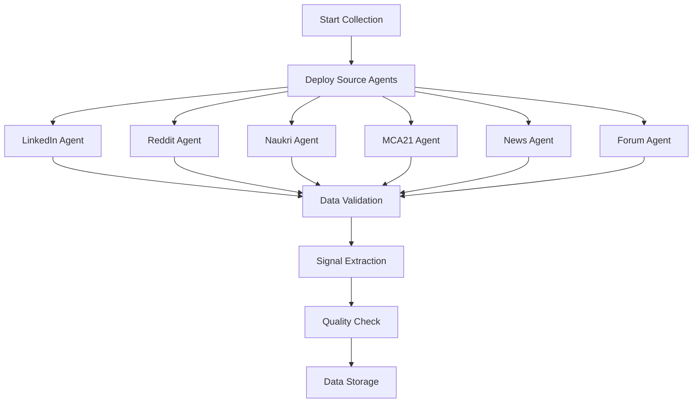

# SeekleAI Workflow Documentation

## Lead Generation Workflow

### 1. Setup and Configuration

#### Initial Setup
1. **ICP Definition**: Define your Ideal Customer Profile parameters
2. **Source Selection**: Choose which data sources to monitor
3. **Signal Configuration**: Set up relevant business signals to track
4. **Scoring Weights**: Configure importance of different criteria

#### Configuration Parameters
```yaml
# Example ICP Configuration
icp_config:
  company_criteria:
    size_range: [50, 1000]  # employees
    revenue_range: [1M, 100M]  # USD
    industries: ["Software", "SaaS", "Technology"]
    locations: ["US", "CA", "UK"]
  
  signals_to_track:
    growth_signals:
      - employee_growth: weight: 0.8
      - funding_rounds: weight: 0.9
      - expansion_news: weight: 0.7
    
    intent_signals:
      - job_postings: weight: 0.6
      - technology_adoption: weight: 0.7
      - competitor_mentions: weight: 0.5
    
    engagement_signals:
      - social_media_activity: weight: 0.4
      - content_engagement: weight: 0.5
      - event_participation: weight: 0.6
```

### 2. Data Collection Process

#### Agent Deployment


#### Data Collection Schedule
- **High-Frequency Sources** (LinkedIn, News): Every 1-2 hours
- **Medium-Frequency Sources** (Reddit, Forums): Every 4-6 hours
- **Low-Frequency Sources** (MCA21, Naukri): Daily
- **Deep Scans**: Weekly comprehensive analysis

### 3. Data Processing Workflow

#### Stage 1: Raw Data Processing
1. **Data Ingestion**: Collect raw data from all sources
2. **Format Normalization**: Standardize data formats
3. **Initial Validation**: Check data integrity and completeness
4. **Temporary Storage**: Store in processing queues

#### Stage 2: Signal Extraction
1. **Text Analysis**: NLP processing for sentiment and intent
2. **Pattern Recognition**: Identify business growth patterns
3. **Anomaly Detection**: Flag unusual activities or opportunities
4. **Signal Classification**: Categorize signals by type and relevance

#### Stage 3: Data Fusion
1. **Entity Matching**: Link data points to specific companies
2. **Duplicate Resolution**: Merge duplicate entries
3. **Data Enrichment**: Combine information from multiple sources
4. **Quality Scoring**: Assign confidence scores to data points

### 4. ICP Matching and Scoring

#### Matching Algorithm
```python
# Simplified scoring algorithm
def calculate_lead_score(company_data, icp_criteria):
    scores = {
        'fit_score': calculate_fit_score(company_data, icp_criteria),
        'intent_score': calculate_intent_score(company_data.signals),
        'timing_score': calculate_timing_score(company_data.recent_activity),
        'contact_score': calculate_contact_score(company_data.contacts)
    }
    
    # Weighted overall score
    overall_score = (
        scores['fit_score'] * 0.4 +
        scores['intent_score'] * 0.3 +
        scores['timing_score'] * 0.2 +
        scores['contact_score'] * 0.1
    )
    
    return {**scores, 'overall_score': overall_score}
```

#### Scoring Criteria
- **Fit Score**: Company size, industry, location, technology stack
- **Intent Score**: Recent activities indicating purchase intent
- **Timing Score**: Optimal engagement timing based on signals
- **Contact Score**: Availability and quality of contact information

### 5. Lead List Generation

#### Output Preparation
1. **Score Ranking**: Sort companies by overall score
2. **Segmentation**: Group leads by score ranges and characteristics
3. **Contact Enrichment**: Add decision-maker contact information
4. **Insight Generation**: Create actionable recommendations

#### Delivery Formats
- **JSON API**: Real-time programmatic access
- **CSV Export**: Bulk data download
- **Dashboard**: Interactive web interface
- **Email Reports**: Automated periodic summaries

### 6. Quality Assurance Process

#### Automated Quality Checks
- **Data Completeness**: Ensure all required fields are populated
- **Source Verification**: Cross-reference information across sources
- **Recency Validation**: Check data freshness and relevance
- **Duplicate Detection**: Identify and merge duplicate entries

#### Manual Review Process
- **High-Value Leads**: Manual verification for top-scored leads
- **Edge Cases**: Human review for unusual or complex cases
- **Feedback Integration**: Incorporate user feedback into scoring models
- **Continuous Improvement**: Regular model retraining and optimization

### 7. Monitoring and Alerting

#### System Health Monitoring
- **Agent Status**: Real-time monitoring of all data collection agents
- **Data Flow**: Track data processing pipeline performance
- **Quality Metrics**: Monitor data quality and accuracy trends
- **System Performance**: CPU, memory, and response time monitoring

#### Alert Configuration
```yaml
alerts:
  agent_failure:
    threshold: "3 consecutive failures"
    notification: "immediate"
    channels: ["email", "slack"]
  
  data_quality_drop:
    threshold: "quality_score < 0.7"
    notification: "hourly"
    channels: ["dashboard"]
  
  high_value_lead:
    threshold: "overall_score > 90"
    notification: "immediate"
    channels: ["email", "webhook"]
```

### 8. Performance Optimization

#### Continuous Improvement Process
1. **Performance Analysis**: Regular review of scoring accuracy
2. **A/B Testing**: Test different algorithms and parameters
3. **User Feedback**: Incorporate conversion data and user input
4. **Model Retraining**: Update ML models with new data
5. **Process Refinement**: Optimize workflows based on results

#### Key Performance Indicators (KPIs)
- **Lead Quality Score**: Average quality of generated leads
- **Conversion Rate**: Percentage of leads that convert
- **Data Freshness**: Average age of data points
- **System Uptime**: Availability of data collection services
- **Processing Speed**: Time from data collection to lead delivery

This workflow ensures consistent, high-quality lead generation that continuously improves over time through machine learning and user feedback.